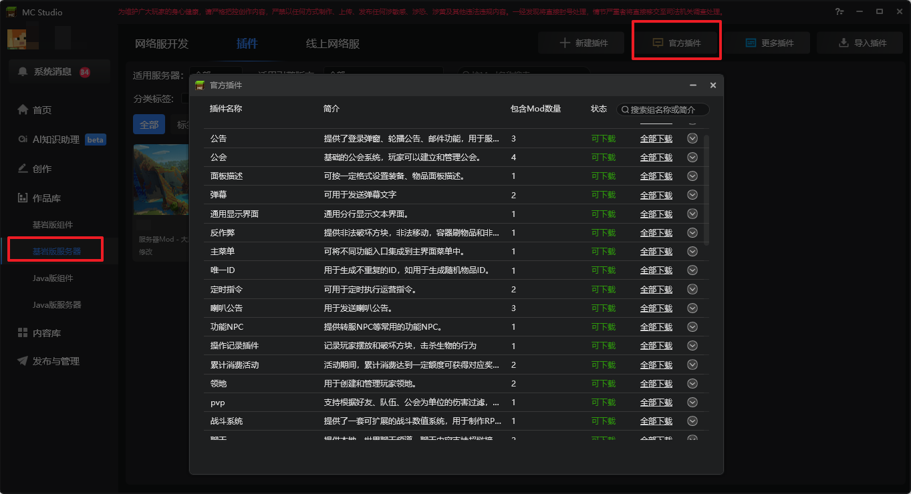

# 官方插件介绍

官方插件也就是公共Mod，我们建议服主在官方插件的基础上做二次开发，节省自己的开发成本。

这个文档用于快速了解每个官方插件的作用。插件的具体功能可通过每个Mod里的readme.txt文件和mod.json文件来了解。

通过MC Studio中基岩版服务器分页的**官方插件**按钮，可获取到目前官方提供的所有服务器插件。

## 游戏玩法
### 领地 插件
支持将某个区域设为玩家的专属领地，非领地所有者会被限制权限，如不能破坏方块、不能与实体交互等等。实现经典的领地和家园玩法均需使用该插件。

### 区块版领地 插件

区块版领地插件，插件功能有：
1、可将1个区域设置为某个玩家专属领地，基于领地迁移的需求，当前要求单个地图区块只能存在一个零级领地
2、使用该插件后，开发者可以设置领地内的一些规则，比如设置可使用方块列表、可破坏方块列表、是否可伤害其他玩家等
3、支持子领地的创建
4、每个领地均可单独设置领地权限，并且可以对非所有者的外部玩家设置特殊权限
5、支持简单的客户端领地区域预览与领地创建
6、支持领地的迁移

插件依赖：地图转存数据库插件（neteaseMapChunk）：领地的迁移需要此插件支持

### 私有箱子 插件
该插件支持将箱子设置为玩家的专属箱子，其他人需申请权限才能打开，可用于家园等玩法中。

### 战斗系统 插件
在做RPG玩法时，一般会制作相对原版游戏更加复杂的战斗数值系统，并扩展装备位。战斗系统插件提供的就是这样的功能。

### 宝石 插件
宝石插件实现了为装备镶嵌宝石的功能，宝石的属性通过镶嵌可以最终添加到玩家身上。可参照此插件实现其他装备培养系统。

### 随机传送 插件

用于跨服、跨维度、本维度内随机传送。插件将根据随机参数，自动寻找附近安全着落。

### 回合战斗 插件

通过指定角色、属性、技能、表现等内容，实现常规的回合制战斗。

## 游戏系统

### 公告 插件
在游戏中，我们需要及时的将游戏的信息传递给玩家，公告插件提供了三项这样的能力：
- **邮件**：支持发邮件给玩家，可用于发送奖励、游戏内通知等多种用途。
    
- **登录弹窗**：玩家登录时会弹出一个面板，可用于显示更新公告。
    
- **轮播公告**：可在所有玩家的界面上显示一条轮播信息，可用于高级奖励通告、限时玩法开启通告等功能。
    

### 队伍 插件
提供了通用的队伍功能，若网络服中有需要组队才能进行的玩法，建议使用此插件。
队伍插件支持玩家创建队伍，发布队伍招募信息，玩家也可以通过寻找队伍来发送入队申请。

### 任务 插件
提供了通用的任务功能，适用于制作指引任务、主线任务、支线任务，可用于各种类型的服务器。
此外，任务插件可使用关卡编辑器中的对话和任务组件制作的数据。

### 好友 插件
提供了通用的好友功能，可以通过附近玩家、查找玩家的方式添加好友，还可以自动添加平台好友为游戏内好友。

### 公会 插件
公会（或叫同盟、帮会、社群、家族等）是游戏中很常见的一种社交功能，能够有效的促进游戏中玩家之间的交互。公会插件提供了创建、管理公会的功能，服主可在此基础上开发更多的公会玩法。

### 经济 插件
经济插件可定义多种虚拟货币，快捷的定制商店，通用的摆摊交易功能。

### 主菜单 插件
该插件支持方便的在主界面中添加功能入口按钮。最多可添加16个按钮，可通过折叠按钮收起和展开。

### 喇叭 插件
该插件可在主界面中间显示喇叭公告内容，喇叭的外观和内容支持自定义。

### 弹窗提示 插件
在主界面中可设定位置显示弹窗提示内容，当聊天栏不便于显示提示信息时，可用此插件代替。

### 称号 插件

可在头顶名称的前、后或者顶部增加文字、图片称号，称号可包含属性（需要结合战斗插件使用），另外插件还可用作称号收集图鉴，用于管理未解锁或者已解锁的称号。

### 排行榜 插件

支持排行榜基本操作，包括增、删、刷新、结算等。另外排行榜还支持收集当前服或所有服（game、lobby）的数据。本插件支持单个排行榜，多排行榜的用法可参考“MCStudio——基岩版网络服——排行榜模板“。

### PVP 插件

可用于伤害的队伍、好友、公会过滤，击杀者、仇人记录以及击杀掉落控制。

### 弹幕 插件

支持弹幕显示、发送功能，可设置弹幕颜色以及弹幕头像。

### 面板描述 插件

可按一定格式设置装备、物品面板描述。配合战斗插件使用，面板描述在战斗插件的背包中生效。也可以利用接口把面板描述显示在其他位置。

## 基础功能
### 地图属性 插件
该插件可用于管理地图的通用属性。包括以下主要配置：
- 地图浮空字
- 禁止藤蔓生长，禁止流体流动
- 定时清理掉落物
- 地图边界
- 丢弃和捡起物品控制

### 云端玩家信息 插件
在网络服中，有时需要在不同地图中同步玩家的背包信息，比如主城到家园、主城到RPG副本等。该插件就用于解决该问题。

### 功能NPC 插件
该插件还在完善中，目前提供了转服NPC。
转服NPC：玩家点击转服NPC后，会弹出对话框，点击“确认”可转往对应的服务器。

### 权限管理 插件
目前该插件还在完善过程中，目前仅支持设置不同组玩家的聊天前缀。

### 副本管理 插件
当服务器功能较为完善，就需要关注性能问题了。副本管理插件提供了一种管理单地图多副本的方案，能够较好的优化服务器承载问题。
使用案例：单人新手副本，在一个地图中有20个新手副本区域，然后部署了10个game。那么就支持同时有200个人玩新手副本。使用副本管理插件后，会自动将新手分配到空闲的副本区域，如当前第10个game服的副本区域5空闲，第1个game服中的副本区域1空闲，那么新的想进入副本的玩家会被分配到这两个中的一个。当所有副本区域都满了之后，后续进入的新玩家会出现排队界面。

### 唯一ID 插件
用于生成当前网络服内唯一的ID，例如：每件装备的属性都是随机的，希望有一个ID来标志每一件装备。这种情况就可以用唯一ID插件。

### 飞行 插件

用于开关飞行权限，设置飞行条件、消耗以及可飞行区域。

### 聊天 插件

提供本地、世界聊天频道，聊天内容支持超链接。与好友、组队插件一起使用，可在聊天栏的超链接发起私聊、加好友、组队等功能。

### 聊天记录 插件

可用于记录玩家在原版聊天框中的聊天，记录玩家在官方聊天插件的本地/世界频道的聊天。并且提供了运营指令--支持多种方式来检索聊天记录。

### 面对面交易 插件

可用于玩家之间面对面交易物品、货币。与经济插件、聊天插件联合使用，可得到更强大的功能。

### 外观管理 插件

衣柜功能，可用于外观的预览与购买。外观包括：时装、翅膀、光圈、坐骑等。

### 报名匹配 插件

提供完整的报名、匹配流程。匹配支持个人、组队报名。除了常规匹配，插件还支持非对称对抗的匹配。

### 通用输入界面 插件

包含一个标题，一段文本介绍，一个输入框以及两个按钮的通用界面。上述文本内容以及按钮跳转逻辑支持设置。开发者可便捷使用该功能界面并获得输入内容，无需过多关注客户端逻辑。

### 通用综合界面 插件

包含一个标题，一段文本介绍，若干个按钮（数量支持自定义）的通用界面。上述文本内容以及按钮跳转逻辑支持设置。开发者可便捷使用该功能界面并指定跳转逻辑，无需过多关注客户端逻辑。

### 通用显示界面 插件

包含一个文本框的通用界面，文本框的内容支持设置。开发者可便捷使用该功能界面显示各种文字内容，无需过多关注客户端逻辑。

### 数据转存 插件

简化数据库操作；将地图数据读写同步到数据库。

### 地图转存数据库 插件

1、把游戏原生的地图存档读档的目标，从本地文件调整到MySQL数据库
2、与区块版领地插件配合，实现领地迁移功能

## 活动和运营
### 活动奖励 插件
网络服中会经常有完成活动给奖励的设计：比如首充奖励，冲级奖励，积分累积奖励等等。
活动奖励插件提供了通用的达成条件给奖励的框架，服主只需修改其中的完成条件，就可以复用为不同的活动奖励功能了。

### 每日登录奖励 插件
给予玩家每日登录的奖励，能够促进玩家活跃，提升玩家留存。该插件提供了一个通用的每日登录奖励功能。

### 商城 插件
商城插件用于服主更方便的接入通用的钻石商城。网络服准备接入商业化功能时，可以使用此插件。

### 运营数据 插件
网络服上线后，需要查看玩家数量、留存、收入等数据，这时就可使用运营数据插件。该插件会将运营数据记录到数据库，配合Grafana能够查看到可视化的数据图表。

### 累计消费活动 插件

活动期间，累计消费达到一定额度可获得对应奖励。

### 定时指令 插件

可用于定时执行运营指令。

### 反作弊 插件
反作弊插件用于检查游戏中玩家一些常见作弊问题：

1、引入源于微软的非法破坏方块监测功能
2、引入源于微软的非法移动监测功能与倒带模拟功能
3、监测发现内存修改类杀戮光环行为
4、监测发现利用砂轮、织布机、切石机、锻造台刷物品、引入非法附魔的行为

### 操作记录插件

记录玩家常规的摆放、破坏、击杀行为，可用于回滚指定区域内的方块、生物状态：

1、记录玩家正常操作摆放方块的行为
2、记录玩家正常操作破坏方块的行为
3、记录玩家正常操作击杀生物的行为
4、记录玩家打开各种箱子的行为（末影箱除外），并记录此时箱子中的物品
5、记录玩家关闭各种箱子的行为（末影箱除外），并记录此时箱子中的物品
6、回滚指定区域内，玩家对方块的操作到指定时间点，并记录相关操作

